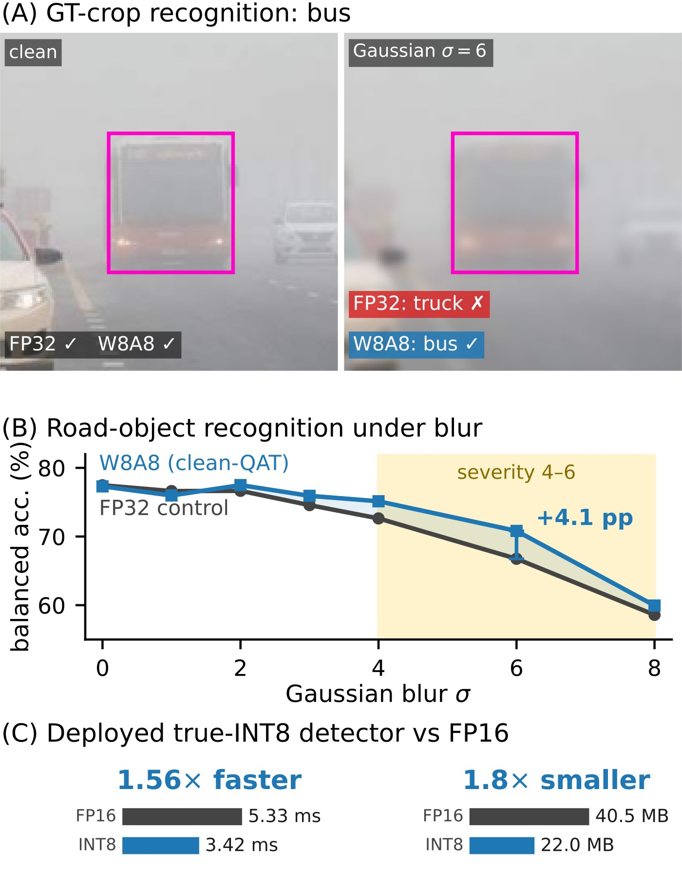
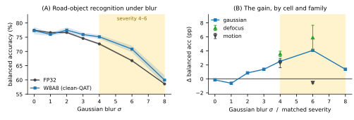
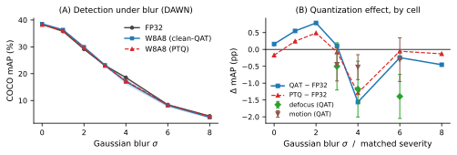
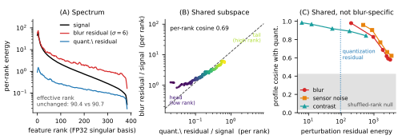
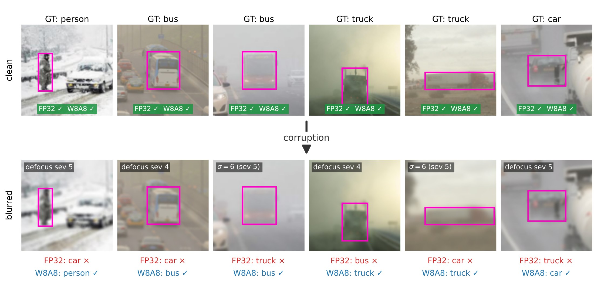
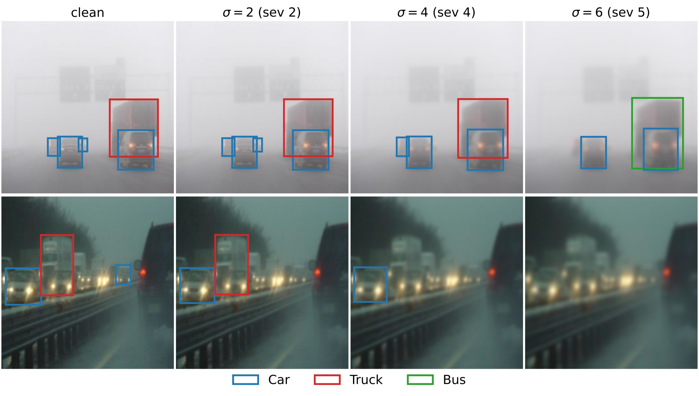

<div align="center">

# Quantization and Corruption Robustness<br>in Deployed Road-Scene Perception

**Aymen Bouguerra** · **Ansgar Radermacher** · **Fabio Arnez** · **Chokri Mraidha**

Université Paris-Saclay, CEA-List

**IEEE ICVES 2026** · Regular paper

[](https://aymenbouguerra.github.io/Quantization-and-Corruption-Robustness-in-Deployed-Road-Scene-Perception/)
[](https://github.com/CEA-LIST/Quantization-and-Corruption-Robustness-in-Deployed-Road-Scene-Perception)
[](#-citation)



<sub><b>(A)</b> Under Gaussian blur σ=6 the full-precision model calls this bus a truck; the 8-bit model does not.<br>
<b>(B)</b> The quantized encoder is more accurate through the moderate-to-heavy blur window.<br>
<b>(C)</b> Deployed as true INT8, the detector is 1.56× faster and 1.8× smaller.</sub>

</div>

---

> **TL;DR:** 8-bit quantization is usually assumed to make perception models more fragile. On real
> adverse-weather driving images, it does not: the quantized **detector** is as robust to blur as its
> full-precision counterpart, and a quantized **recognition** encoder is *more* robust, while both run
> faster and smaller as true INT8 models. No corrupted image is ever seen during training.

## 🌐 Project page

**[aymenbouguerra.github.io/Quantization-and-Corruption-Robustness-in-Deployed-Road-Scene-Perception](https://aymenbouguerra.github.io/Quantization-and-Corruption-Robustness-in-Deployed-Road-Scene-Perception/)**

## 💻 Code

The reproduction code is available at
**[CEA-LIST/Quantization-and-Corruption-Robustness-in-Deployed-Road-Scene-Perception](https://github.com/CEA-LIST/Quantization-and-Corruption-Robustness-in-Deployed-Road-Scene-Perception)**.

## ✨ Highlights

- 🚗 **Detection is unharmed:** W8A8 RT-DETR stays within **1.7 COCO mAP** of FP32 in all 13 conditions, uncorrupted and blurred.
- 🎯 **Recognition improves:** W8A8 DINOv2 gains **+4.1 pp** at Gaussian σ=6 and **+5.9 pp** at defocus
  severity 5 (balanced accuracy, 3 seeds).
- ⚡ **Faster and smaller:** with true INT8 on custom CUTLASS kernels, the detector is **1.56×** faster and
  **1.8×** smaller; the encoders are **1.36–2.13×** faster.
- 🔬 **A mechanism, with controls:** quantization noise and blur perturb the **same high-rank feature
  directions**, and a matched-noise control does *not* reproduce the gain.
- 🧪 **Uncorrupted training only:** no synthetically corrupted image is used in training or calibration; blur
  appears at evaluation only.

<details>
<summary><b>Abstract</b></summary>
<br>

Quantization lowers weight and activation precision to fit neural networks onto automotive hardware, and is assumed to cost robustness to degraded camera inputs. For road-scene perception, that cost has never been measured under matched training budgets. On an adverse-weather driving benchmark, a separate 8-bit quantization-aware trained recognition encoder is *more* accurate under moderate-to-heavy Gaussian and defocus blur than its full-precision counterpart by several points of balanced accuracy. It saw no synthetically corrupted image in training and blur only at evaluation. Training does the work, not the arithmetic: a control trained with injected noise of matched magnitude does not reproduce the gain, and training-free quantization reproduces it only in part. We link the effect to a shared feature subspace: quantization noise and blur perturb the same high-rank directions of the representation. A model trained to remain accurate despite its own quantization noise therefore inherits accuracy under blur. The gain is confined to a severity window and reverses once the input is too degraded to read. The detector that ships in the vehicle loses no aggregate robustness under the same quantization and runs faster and smaller as a true INT8 model. The recognition gain therefore comes at no measurable cost to the deployed detector.

</details>

## 📊 Key results

### Recognition becomes more robust to blur it never saw

<p align="center"></p>

A W8A8 DINOv2 ViT-S/14, trained with LSQ on **uncorrupted** crops of DAWN road objects, is more accurate
than its FP32 counterpart through the moderate-to-heavy blur window (bootstrap-significant for Gaussian
and defocus blur). The gain peaks just past severity 5 and reverses once the input is too degraded to read.

### The detector loses nothing

<p align="center"></p>

Under a budget-matched protocol, where FP32, W8A8 QAT and W8A8 PTQ all derive from one converged detector
with the same data, schedule and seeds, the three variants are essentially superposed from uncorrupted input
to near task failure, for Gaussian, defocus and motion blur.

### Quantization noise and blur share a feature subspace

<p align="center"></p>

Both residuals concentrate in the high-rank tail of the representation and fall along a common line, rank
by rank. Training to stay accurate under its own quantization noise gives the model invariance in exactly
the directions blur perturbs.

<details>
<summary><b>Per-object examples:</b> the full-precision model flips, the quantized model does not</summary>
<br>
<p align="center"></p>
</details>

<details>
<summary><b>Detector predictions under increasing blur</b></summary>
<br>
<p align="center"></p>
</details>

## 📝 Citation

If you find this work useful, please cite:

```bibtex
@inproceedings{bouguerra2026perception,
  title     = {Quantization and Corruption Robustness in Deployed Road-Scene Perception},
  author    = {Bouguerra, Aymen and Radermacher, Ansgar and Arnez, Fabio and Mraidha, Chokri},
  booktitle = {IEEE International Conference on Vehicular Electronics and Safety (ICVES)},
  address   = {Cochabamba, Bolivia},
  year      = {2026}
}
```

This work builds on the spectral-filtering view of quantization introduced in our ICML 2026 paper
[*Less Precise Can Be More Reliable: A Systematic Evaluation of Quantization's Impact on VLMs Beyond
Accuracy*](https://arxiv.org/abs/2509.21173), by **Aymen Bouguerra**, Daniel Montoya, Alexandra Gomez-Villa,
Chokri Mraidha and Fabio Arnez.

```bibtex
@inproceedings{bouguerra2026lessprecise,
  title     = {Less Precise Can Be More Reliable: A Systematic Evaluation of Quantization's Impact on {VLMs} Beyond Accuracy},
  author    = {Bouguerra, Aymen and Montoya, Daniel and Gomez-Villa, Alexandra and Mraidha, Chokri and Arnez, Fabio},
  booktitle = {International Conference on Machine Learning (ICML)},
  year      = {2026}
}
```

---

<sub>© 2026 IEEE. Personal use of this material is permitted. Permission from IEEE must be obtained for all other uses, in any current or future media, including reprinting/republishing this material for advertising or promotional purposes, creating new collective works, for resale or redistribution to servers or lists, or reuse of any copyrighted component of this work in other works. The abstract and figures above are from the accepted version of the paper; the definitive version will be available on IEEE Xplore.</sub>
